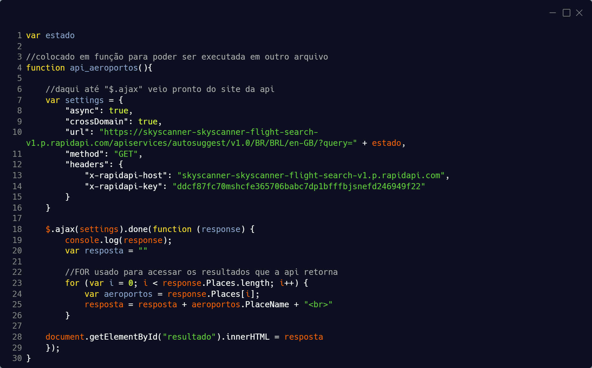
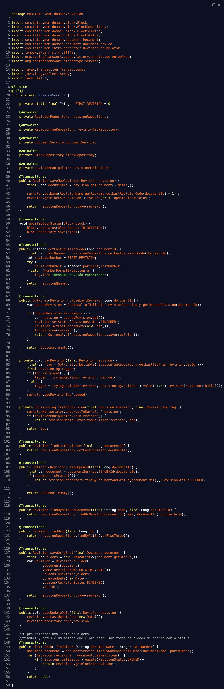

# [Devanir Ramos Junior](https://br.linkedin.com/in/devanir-ramos-junior)
<p align="center"></p>

Estudo Banco de Dados na [Fatec prof. Jessen Vidal](https://fatecsjc-prd.azurewebsites.net).

Comecei o curso sem saber muita coisa técnica de programação, só conhecia um pouco da lógica porque gosto de entender 
certos aspectos de jogos (o motivo de certos bugs funcionarem, como eram otimizados no passado, etc). Hoje em dia trabalho 
como desenvolvedor Full Stack Junior, mas tenho preferência pro back-end.

### Principais conhecimentos:
- Python (em específico Django);
- Vue.js;
- Java (em específico Spring Boot);
- Bancos SQL (utilizei MySQL, Oracle, SQLite e PostgreSQL);
- Bancos NoSQL (utilizei MongoDB e Firebase).

Meu Linktree está [disponível aqui](https://linktr.ee/devrjr).


# Portfólio dos APIs (Aprendizagem por Projetos Integrados) - BD

## API 1º Semestre (2020-1)

<div align="center">

### [NUNA, assistente de voz para viagens](https://github.com/arienemaiara/assistente-voz-viagens) </div>
<p align="center"></p>

Este projeto consistiu do desenvolvimento de uma assistente ativada por comando de voz para auxiliar em viagens e na estadia. 
O desafio base era "assistente de voz" e as equipes deveriam pensar em algum tema para a assistente. Foi decidido desenvolver 
uma assistente de viagens que funciona por web, assim é possivel utilizar em qualquer dispositivo com acesso a internet. 
Este projeto não foi feito em parceria com empresas, mas foi desenvolvido com a ajuda de uma aluna do sexto semestre, que 
fez o papel de Scrum Master.

### Tecnologias Utilizadas
<a href="https://developer.mozilla.org/pt-BR/docs/Web/HTML/Element">
  
</a>
<a href="https://nodejs.org/en/">

</a>
<a href="https://www.javascript.com/">
  
</a>

Tecnologias básicas para desenvolvimento web, pois como foi o primeiro API alguns integrantes não possuiam conhecimento em programação.

### Contribuições Pessoais
<li><b>Desenvolvi a página de conversão de moeda com toda a lógica de pegar os dados de uma API de moedas e 
convertar os valores entre Real, Dólar e Euro.</b><br><br>

<details><summary>API de moedas:</summary>
<p></p></details><br>

<details><summary>HTML:</summary>
<p></p></details><br>

<details><summary>JS com a lógica do reconhecimento de voz:</summary>
<p></p></details><br>

<li><b>Também construi a página de aeroportos, onde o usuário diz o nome de uma cidade e na página é mostrado os 
aeroportos próximos.</b><br><br>

<details><summary>API que retorna os aeroportos próximos do local requisitado:</summary>
<p></p></details><br>

<details><summary>HTML:</summary>
<p></p></details><br>

<details><summary>JS com a lógica do reconhecimento de voz:</summary>
<p></p></details><br>

<li><b>E por fim, fiz a página de recomendação de filmes, que consome uma API desenvolvida pela Scrum Master do 6.º semestre.</b><br><br>

<details><summary>API da Scrum Master:</summary>
<p></p></details><br>

<details><summary>HTML:</summary>
<p></p></details>

<div style="display: flex">
<div style="float: left; width: 50%">

### Hard Skills Desenvolvidas
- Aprendi sobre versionamento de código com GIT;
- Programei utilizando JavaScript e HTML;
- Aprendi sobre a metodologia ágil Scrum.
</div>

<div style="float: right; width: 50%">

### Soft Skills Desenvolvidas
 - Trabalho em equipe (todos unidos se ajudando por terem pouco conhecimento em programação);
 - Confiança (poder contar com a ajuda de todos);
 - Organização (conseguir organizar e manejar as tarefas da API e matérias do curso).
 
Primero trabalho de API realizado, precisou de muito trabalho em equipe e organização.
</div>
</div>

## API 2º Semestre (2020-2)
<div align="center">

### [Software para digitação de contas de água e luz](https://github.com/DevanirRamosJr/Projeto_Integrador2) </div>

Este projeto consistiu do desenvolvimento de um software para poder digitar coom facilidade os dados importantes de contas 
de água ou luz para salvar em um banco local, com a possibilidade de editar algum dado de contas já salvas e gerar arquivo 
csv com os dados de uma conta. Este projeto foi realizado em parceria com a empresa TecSUS do Parque Tecnológico.

### Tecnologias Utilizadas
<a href="https://developer.mozilla.org/pt-BR/docs/Web/HTML/Element">
  
</a>
<a href="https://developer.mozilla.org/pt-BR/docs/Web/HTML/Element">
  
</a>

Tecnologias escolhidas para desenvolver uma aplicação desktop em Java utilizando Swing.

### Contribuições Pessoais
<li><b>Por volta da metade do projeto me tornei Scrum Master da equipe, então fiquei encarregado de organizar as tarefas por Sprint e informar o professor encarregado da API.</b><br><br>

<li><b>Se tratando de programação, criei uma tela de "preparação", que cria o banco com suas respectivas tabelas e permite criar usuários para a aplicação. 
Também fiz a tela inicial da aplicação, que pede os dados para conectar com o banco.</b><br><br>

<details><summary>Preparação do banco (tela base):</summary>
<p></p></details><br>

<details><summary>Preparação do banco (lógica que cria a tabela de login):</summary>
<p></p></details><br>

<details><summary>Tela inicial para conseguir conectar ao banco:</summary>
<p></p></details><br>

<li><b>Criei a tela de login do sistema.</b><br><br>

<details><summary>Tela de Login:</summary>
<p></p></details><br>

<li><b>Fiz a página de exportação para csv.</b><br><br>

<details><summary>Tela de Relatório:</summary>
<p></p></details>


<div style="display: flex">
<div style="float: left; width: 50%">

### Hard Skills Desenvolvidas
- Aprimorei meus conhecimentos sobre versionamento com GIT;
- Programei utilizando Java e conectando com o banco MySql;
- Programei a interface gráfica com Java Swing.
</div>

<div style="float: right; width: 50%">

### Soft Skills Desenvolvidas
- Liderança (pela experiência de Scrum Master);
- Responsabilidade (por ter que cuidar da equipe e informar o professor responsável);
- Organização de equipe (ter que fazer a distribuição das tarefas e organizar as sprints);

Skills escolhidas pelo fato de me tornar Scrum Master na metade do projeto.
</div>
</div>

## API 3º Semestre (2021-1)
<div align="center">

### [MOM - Management of Operational Manuals](https://github.com/API-FATEC/API_3sem_2021-01) </div>

```
                        `7MMM.     ,MMF'  .g8""8q.   `7MMM.     ,MMF'
     ,;//'     ,;//'      MMMb    dPMM  .dP'    `YM.   MMMb    dPMM      `\\.      `\\.
  ,;//'     ,;//'         M YM   ,M MM  dM'      `MM   M YM   ,M MM         `\\:.     `\\:.
,//'      ,//'            M  Mb  M' MM  MM        MM   M  Mb  M' MM            `\\.      `\\.
`\\.      `\\.            M  YM.P'  MM  MM.      ,MP   M  YM.P'  MM           ,;//'     ,;//'
   `\\:.     `\\:.        M  `YM'   MM  `Mb.    ,dP'   M  `YM'   MM        ,;//'     ,;//'
      `\\.      `\\.    .JML. `'  .JMML.  `"bmmd"'   .JML. `'  .JMML.    ,//'      ,//'
```

Este projeto consistiu do desenvolvimento de um sistema para facilitar o gerenciamento dos manuais de produto, podendo 
revisar, aprovar e escolher quais blocos irão formar o manual completo. Este projeto foi realizado em parceria com a Embraer, 
em específico a equipe de Publicação Operacional. Na última sprint restou 2 membros da equipe desenvolvendo o projeto.

### Tecnologias Utilizadas
<a href="https://developer.mozilla.org/pt-BR/docs/Web/HTML/Element">
  
</a>
<a href="https://developer.mozilla.org/pt-BR/docs/Web/HTML/Element">
  
</a>
<a href="https://developer.mozilla.org/pt-BR/docs/Web/HTML/Element">
  
</a>
<a href="https://developer.mozilla.org/pt-BR/docs/Web/HTML/Element">
  
</a>

Vue.js foi escolhido para termos mais facilidade no desenvolvimento do front-end. Spring foi escolhido pra ser o back-end com APIs REST.

### Contribuições Pessoais
<li><b>Criei por conta própia uma classe referente a ler e retornar os dados de um arquivo csv.</b><br><br>

<details><summary>Classe Reader:</summary>
<p></p></details>

<br><li><b>Fiz endpoints, repository, service e teste relacionados a revisão</b><br><br>

<details><summary>Controller:</summary>
<p></p></details><br>

<details><summary>Repository:</summary>
<p></p></details><br>

<details><summary>Service:</summary>
<p></p></details><br>

<details><summary>Testes:</summary>
<p></p></details><br>

<details><summary>Script SQL usado no teste:</summary>
<p></p></details>

<br><li><b>Fiz o gerador da LEP (List of Effective Pages) de acordo com os blocos que fazem parte do manual. 
Por questão de tempo e falta de integrantes foi feito com dados pré-definidos</b><br><br>

<details><summary>LEP Generator:</summary>
<p></p></details>

<div style="display: flex">
<div style="float: left; width: 50%">

### Hard Skills Desenvolvidas
- Aprimorei meus conhecimentos sobre versionamento com GIT;
- Aprendi sobre o padrão de projeto Model View Controller;
- Programei utilizando Java Spring Boot;
- Realizei a conexão entre Oracle Cloud Database e Java;
- Aprendi sobre a existencia e implementação de testes unitários.
</div>

<div style="float: right; width: 50%">

### Soft Skills Desenvolvidas
- Responsabilidade (por ter que me comprometer mais ao projeto devido ao abandono de membros da equipe);
- Gestão de tempo (por precisar gerenciar mais o tempo entre a API e matérias);
- Autonomia (porque nos endpoints e testes tive liberdade para desenvolvê-los).

Skills escolhidas devido abandono de menbros da equipe durante o projeto, que ocasionou em uma certa mudança na 
organização das tarefas que cada um tinha.
</div>
</div>


## API 4º Semestre (2021-2)
<div align="center">

### [AgendHouse](https://github.com/API-4-SEMESTRE/PROJETO-API) </div>
<p align="center"></p>

Este projeto consistiu do desenvolvimento de um sistema para o agendamento de diversas categorias de eventos na Casa Oracle, 
tendo em mente medidas de segurança relacionados a Covid-19. Este projeto foi realizado em parceria com a Oracle Brasil, 
que possui o espaço Casa Oracle, que com a mudança nas restrições sanitárias devido à pandemia sua estratégia para organizar 
eventos mudou e seria mais prático ter uma plataforma web própria.

### Tecnologias utilizadas
<a href="https://vuejs.org/">
  
</a>
<a href="https://www.javascript.com/">
  
</a>
<a href="https://www.java.com/pt-BR/">
  
</a>
<a href="https://spring.io/projects/spring-boot">
  
</a>
<a href="https://www.oracle.com/br/cloud/">
  
</a>
<a href="https://www.atlassian.com/software/jira">
  
</a>

Vue.js foi escolhido para termos mais facilidade no desenvolvimento do front-end. Spring foi escolhido pra ser o back-end com APIs REST. 
Foi utilizado o banco da Oracle Cloud para a aplicação ter um banco único entre todos os membros da equipe. 
O Jira foi utilizado para uma melhor organização e visualização das tarefas.

### Contribuições Pessoais
<li><b>Criei por conta própia o back-end dos CRUDs relacionados ao visitante e eventos, ajudei com os CRUDs do 
fornecedor, contato e evento. Realizei a conexão do backend com o Banco Oracle Cloud (utilizando wallet). Ajudei 
um pouco no frontend da página do fornecedor, fiquei responsável por fazer funcionar o autocomplete do CEP.</b><br><br>

<details><summary>Página do fornecedor (apenas html referente ao CEP):</summary>
<p></p></details><br>

<details><summary>Página do fornecedor (apenas script referente ao CEP):</summary>
<p></p></details>

<br><li><b>Criei por conta própria toda a parte do envio de emails que são realizados ao marcar um evento.</b><br><br>

<details><summary>Lógica de criação dos email:</summary>
<p></p></details><br>

<details><summary>Um template de email utilizado (quando o colaborador agenda um evento ele receberá este email):</summary>
<p></p></details><br>


<div style="display: flex">
<div style="float: left; width: 50%">

### Hard Skills Desenvolvidas
- Aprimorei meus conhecimentos sobre o padrão de projetos Model View Controller;
- Programei utilizando Java Spring Boot;
- Programei um pouco utilizando JavaScript e ViewJs.
</div>

<div style="float: right; width: 50%">

### Soft Skills Desenvolvidas
- Comprometimento (por precisar me dedicar mais ao projeto devido ao abandono de membros da equipe);
- Autonomia (porque tive liberdade na hora de desenvolver os endpoints e emails);
- Trabalho em Equipe (por conseguir entregar um bom produto final apesar do abandono de membros da equipe).

Skills escolhidas porque novamente ocorreu abandono de membros da equipe durante o projeto.
</div>
</div>


## API 5º Semestre (2022-1)
<div align="center">

### [SAS - Score Analysis System](https://github.com/API-5-SEMESTRE) </div>
<p align="center"></p>

Este projeto consistiu do desenvolvimento de um sistema que possibilita a prospecção de possíveis novas empresas clientes. 
Foi disponibilizado bases de dados por arquivos csv com diversas informações, como o estado das empresas cliente, quais 
os ramos, quantidade de produtos queé consumida (em dinheiro) e se é cliente da empresa parceira do API ou de uma empresa 
concorrente ou nenhuma das duas. O desafio foi organizar e mostrar os dados de uma forma fácil para que seja realizado uma 
prospecção de novos clientes. O projeto foi feito em parceria com o SPC Brasil.
  
### Tecnologias utilizadas
<a href="https://vuejs.org/">
  
</a>
<a href="https://www.javascript.com/">
  
</a>
<a href="https://spring.io/projects/spring-boot">

</a>
  <a href="https://www.python.org/">
  
</a>
<a href="https://flask.palletsprojects.com/en/2.1.x/">
  
</a>
<a href="https://pandas.pydata.org/">
  
</a>
<a href="https://www.postman.com/">
  
</a>
  <a href="https://www.oracle.com/br/cloud/">

</a>
  <a href="https://www.atlassian.com/br/software/jira">
  
</a>
<a href="https://www.heroku.com/">
  
</a>

Vue.js foi escolhido para termos mais facilidade no desenvolvimento do front-end. Spring foi escolhido pra ser o back-end com APIs REST.
Flask foi utilizado para realizar o download das imagens dos gráficos (foi feito separado para não gerar conflitos no desenvolvimento do 
back-end principal). Postman foi utilizado para auxiliar nos testes das API REST. Banco da Oracle Cloud  utilizado para a aplicação ter 
um banco único entre todos os membros da equipe. Jira utilizado para uma melhor organização e visualização das tarefas. Heroku utilizada 
para fazer o deploy do front-end e dos dois back-end. Também foi utilizado o Power BI para realizar uma amostragem detalhada e dinâmica dos dados.

### Contribuições Pessoais
* <b>Fiquei responsável por toda a parte em python, que foi criar gráficos para download no frontend e analisar os dados para 
auxiliar na prospecção. A criação dos gráficos foi feita com pandas e pyplot, enquanto que a integração com o front foi realizada 
com endpoint do Flask (hospedado na heroku para que toda a aplicação ficasse disponível online).</b><br><br>
  
<details><summary>Geração dos gráficos:</summary>
<p></p></details><br>
  
<details><summary>Endpoints do Flask:</summary>
<p></p></details><br>
  
* <b>A análise de dados realiza foi a criação de um novo campo pra cada cliente do banco, criei o Score, que é uma nota (0 - 1000) 
atribuída baseada nas variáveis:</b><br>
  * Localização: dependendo da localização o Score aumenta ou abaixa, porque clientes de um estado onde a média de consumo é baixa 
    dificilmente teriam um Score "competitivo" com os que ficam no estado de maior consumo, então nessa situação o Score recebe um boost 
    para ficar equivalente.<br>
  * Consumo nos últimos meses: o Score aumenta ou abaixa se o cliente consumiu mais ou menos que o mês anterior.</b><br><br>
  
<details><summary>Geração do Score:</summary>
<p></p></details><br>


<div style="display: flex">
<div style="float: left; width: 50%">

### Hard Skills Desenvolvidas
- Utilizei pela primeira vez Flask;
- Fiz o deploy do backend Python na Heroku;
- Fiz a conexão entre Oracle Cloud Database e Python, que foi bem mais complicado do que conectar com Java.
</div>

<div style="float: right; width: 50%">

### Soft Skills Desenvolvidas
- Trabalho em equipe (por ter tido o apoio da minha equipe em relação ao Score);
- Gestão de tempo (porque foi o primeiro semestre que trabalhei e estudei);
- Organização (assim como a gestão de tempo, foi pelo fato de precisar me organizar pra realizar as tarefas da API e matérias).

Skills escolhidas porque foi o primeiro semestre que trabalhei, então tive que me ajustar para realizar minhas tarefas.
</div>
</div>


## API 6º Semestre (2022-2)
<div align="center">

### [CATE - Coleta Análise Tratamento Exibição](https://github.com/API-6-SEMESTRE) </div>
<p align="center"></p>

Este projeto consistiu do desenvolvimento de um sistema para a análise de dados referentes a cobranças e pagamentos. A 
empresa parceira do projeto é responsável por cuidar do conciliamento entre o pagamento recebido e a cobrança, que são 
atividades de duas empresas diferentes, e o desafio foi analisar as bases de dados disponibilizadas e visualizar os resultados 
de uma forma simples.


### Tecnologias utilizadas
<a href="https://www.python.org/">
  
</a>
<a href="https://pandas.pydata.org/">
  
</a>
<a href="https://jupyter.org/">
  
</a>
<a href="https://www.mongodb.com">
  
</a>
<a href="https://developer.mozilla.org/pt-BR/docs/Web/HTML/Element">
  
</a>

Python com Pandas + Jupyter Notebook foram utilizados para realizar as análises de dados. MongoDB foi utilizado para guardar os dados entre 
os níveis das análises de dados, pois nem sempre os dados possuiam um padrão. MySQL utilizado para guardar os dados após passar pela última 
etapa da análise, onde eles possuiam um padrão. Também foi utilizado o Power BI para realizar uma amostragem detalhada e dinâmica dos dados.

### Contribuições Pessoais
* <b>Após a inserção dos dados base no MongoDB é ativado o meu script, que coleta esses dados e realiza a análise para 
verificar as conciliações, divergências e anomalias.</b><br><br>

<details><summary>Notebook com um exemplo da análise:</summary>
<p></p></details><br>
O arquivo do Jupiter Notebook pode ser acessado <a href="https://github.com/API-6-SEMESTRE/Projeto/blob/3-Sprint/src/data_analysis.ipynb">clicando aqui.</a>

<div style="display: flex">
<div style="float: left; width: 50%">

### Hard Skills Desenvolvidas
- Aprimorei meus conhecimentos de Pandas;
- Utilizei Jupyter Notebook pela primeira vez;
- Passei um pouco do meu conhecimento sobre Mongo para minha equipe.
</div>

<div style="float: right; width: 50%">

### Soft Skills Desenvolvidas
- Organização (porque a análise de dados é um proceso de 3 etapas);
- Trabalho em equipe (por conseguir realizar uma integração fácil entre a minha parte da análise e os outros);
- Autonomia (por ter liberdade no desenvolvimento do algoritmo de análise da minha etapa).

Skills escolhidas devido ao fato das análises de dados dependerem bastante da compreensão e troca de informações / dúvidas entre o PO e o resto da equipe
</div>
</div>
